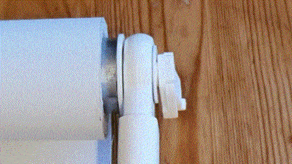
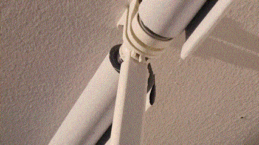
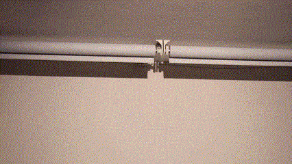
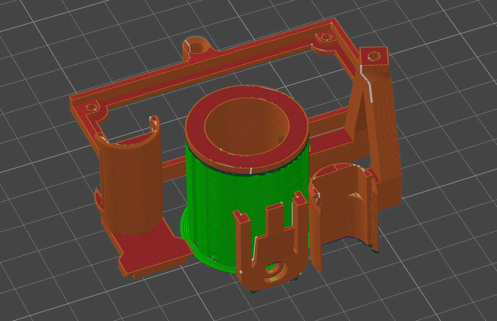
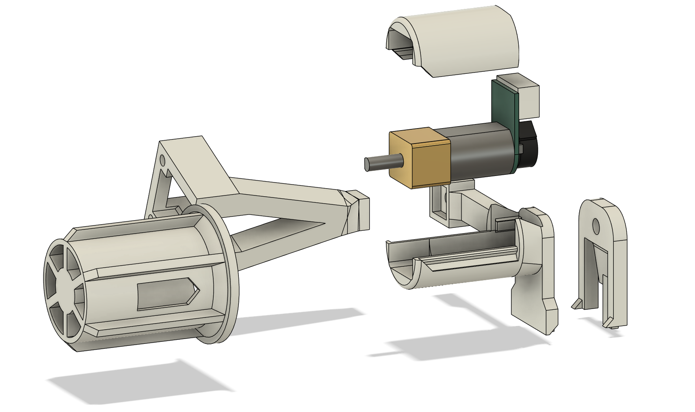
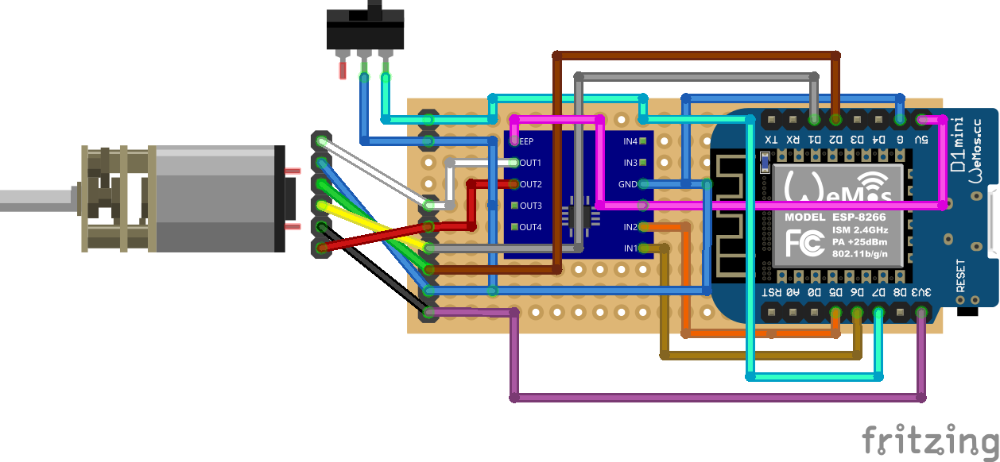

# Yet another IKEA Fridans Motorization (YAIFM)

An affordable, available, easy-to-build drop-in replacement for the orginial “magic wand”. The design has been up and running in my own home for a good half year now and it works without any issues so far. The benefits are:
* Drop-in replacement, i.e. works with the same IKEA wall or ceiling mounts, no new holes or repositioning necessary
* Powered from a regular 5V USB-C power supply
* Works with Home Assistant using ESPHome
* Worldwide availability of components (through Aliexpress and/or other electronics vendors)
* 3D printable on a stock Ender 3

Here are two gifs of how to install the final product:

And here is a gif of it in action:

Interested? This repository has all you need. The basic steps are simple:
1. Print the parts and assemble the motor holder (screwing required)
2. Assemble the control PCB (soldering required)
3. Flash ESPHome and integrate everything within HomeAssistant
4. Remove the wand, pop in the motor assembly, connect the wires
5. Profit

So you have set you mind on building this things? Awesome! **Be sure to check out the [Limitations and constraints](#limitations-and-constraints) section at the end of this document before you start.**
 

# Bill of Materials (BOM)

For building one device, you will need to first obtain all the parts on the Bill of Materials (BOM) in the listed quantities. The BOM is separated in to everything needed for the motor assembly as well as everything needed for the control electronics and the wiring.

You can download a Microsoft [Excel file of the BOM here](https://github.com/AndBu/YAIFM/blob/main/BOM/YAIFM%20Bill%20of%20Materials%20(BOM).xlsx).

## Motor assembly BOM

The motor assembly houses the motor and is equipped with an optional wned stop switch to detect the blind's end stop position. **Please be aware, that while a version without an endstop switch exists, I have not yet created a yaml-script for that**. The motor assembly is the part that gets fit into the pipe instead of the "magic wand". The components needed for the motor assembly are listed below:

| Component              | Description                                                                                                                                                                                                                                                                                                                                                                                                                                                                                                                                                                                                                           | Supplier                                                                                                                 | Alternative                                                 | Quantity | Cost (app.)    |
| ---------------------- | ------------------------------------------------------------------------------------------------------------------------------------------------------------------------------------------------------------------------------------------------------------------------------------------------------------------------------------------------------------------------------------------------------------------------------------------------------------------------------------------------------------------------------------------------------------------------------------------------------------------------------------- | ------------------------------------------------------------------------------------------------------------------------ | ----------------------------------------------------------- | -------- | -------------- |
| Motor holder           | Due to the general limitations of FDM 3D printing, the motor assembly is split into multiple parts: the motor holder, the lid and the clip. An optional switch holder can be attached for using en end-stop switch for the blinds.                                                                                                                                                                                                                                                                                                                                                                                                    | 3D printed                                                                                                               | \-                                                          | 1x       | \-             |
| Motor holder lid       | Lid for motor holder.                                                                                                                                                                                                                                                                                                                                                                                                                                                                                                                                                                                                                 | 3D printed                                                                                                               | \-                                                          | 1x       | \-             |
| Motor holder clip      | The clip is used to snap the motor assembly in place, much like the original wand. The clip has to be printed in a different orientation for easy printing and maximum mechanical stability, so it is a separate part.                                                                                                                                                                                                                                                                                                                                                                                                                | 3D printed                                                                                                               | \-                                                          | 1x       | \-             |
| M3x4mm flat head screw | The orignal IKEA Fridans wand is rivited. My clip is screwed onto the motor holder with a flat M3x4mm screw. The screw's maximum head thickness is 1.5mm. You can probably get away with a thicker screw or just glue it.                                                                                                                                                                                                                                                                                                                                                                                                             | [Aliexpress](https://www.aliexpress.com/item/1005004288328345.html)                                                      | Hardware store                                              | 1x       | 1USD (per set) |
| DC motor               | GA12-N20 miniature geard DC motor wth integrated rotary encoder, with 39RPM @ 6V supply. Different version of this motor exist with different power and torque rating. In order to reliably drive the widest (200cm) IKEA Fridans blinds, I recommend a motor with a stall torque of at least 0.5Nm and a shaft speed of around 39RPM at no load. Be careful, motors can have different electrical characteristics even though they look the same. The Adafruit motor is slower and on the lower end of the torque spectrum. It won't work reliably for blinds >100cm (and even for the narrower blinds, I have not tested it), but I have included it, because it might be easier to source for some of you. | [Aliexpress](https://www.aliexpress.com/item/4001045242610.html?spm=a2g0o.order_list.order_list_main.196.54af1802pgRf9I) | [Adafruit (not for >100cm blinds!)](https://www.adafruit.com/product/4640) | 1x       | 10 USD         |
| Hub                    | The hub sit directly on the motor shaft and transfers the torque from the gearbox to the blind. It should fit rather firmly. I have included multiple parts with different shaft tolerances and I have also included a tolerance tester part so you can choose the right part before printing the whole hub.                                                                                                                                                                                                                                                                                                                          | 3D printed                                                                                                               | \-                                                          | 1x       | \-             |
| Switch holder          | Optional. The switch holder secures the limit switch at the correct angle and distance. The switch holder is long because the plastic reinforcement inside the seam of the blind's fabric triggers switch and it can move. If you have an unusually short reinforcement part, for example because you were not careful when cutting your blinds to fit, you might need to make adjustments to this part.                                                                                                                                                                                                                              | 3D printed                                                                                                               | \-                                                          | 1x       | 5USD (per set) |
| End stop switch        | Optional. This switch can can detect when the blind is fully closed. It is triggered by the long plastic reinforcement part inside the seam of the blind. It is mounted usind the 3D printable switch holder. I kept is simple and stupid using one of my spare limit switches for my Ender 3 V2 3D printer.                                                                                                                                                                                                                                                                                                                          | [Aliexpress](https://nl.aliexpress.com/item/1005003409480909.html)                                                       | Any other Creality-like end stop limit switch               | 1x       | 3USD (per set) |
| M2.5x6mm screw         | Optional: This screw is used to mount the switch holder to the motor holder and the switch to the switch holder. If you use the switch holder, you will need these screws.                                                                                                                                                                                                                                                                                                                                                                                                                                                            | [Aliexpress](https://www.aliexpress.com/item/1005004288328345.html)                                                      | Hardware store                                              | 3x       | 1USD (per set) |

## Control PCB

The control PCB drives the motor, reads the rotary encoder for accurate position sensing and connects to your home's WIFI for integrating with HomeAssistant. The components needed for the control PCB are listed the following:

| Component                   | Description                                                                                                                                                                                                                                                                                                                                                                                               | Supplier                                                            | Alternative                                        | Quantity | Cost (app.)    |
| --------------------------- | --------------------------------------------------------------------------------------------------------------------------------------------------------------------------------------------------------------------------------------------------------------------------------------------------------------------------------------------------------------------------------------------------------- | ------------------------------------------------------------------- | -------------------------------------------------- | -------- | -------------- |
| WeMos D1 MINI               | The WeMos D1 MINI is a small ESP8266 powered WIFI-enabled microcontroller board. Many compatible boards exist such as the newer Lolin S2 mini, which comes with a beefier ESP32-S2 processor. If you don't have a WeMos D1 MINI lying around, I'd recommend going for the Lolin S2 mini as it is simply put the much better board, especially since ESP8266 GPIOs do really strange things during bootup. | [Aliexpress](https://www.aliexpress.com/item/1005006018009983.html) | WEMOS D1 mini compatible board from local supplier | 1x       | 5USD           |
| DC motor driver             | The DRV8833 is a common, affordable, low-power motor driver with two independently controllable H-bridges. Different boards from different suppliers exist. You can of course also use any other compatible H-bridge DC motor driver such as the popular MX1508 but watch out for the changed dimensions any pinning.                                                                                     | [Aliexpress](https://aliexpress.com/item/4000083406292.html)        | Local electronics supplier                         | 1x       | 1USD           |
| Perfboard                   | I used common perfboard for holding the electronics in place. If you want to use my PCB holder, your perfboard will to be 3cm x 7cm.                                                                                                                                                                                                                                                                      | [Aliexpress](https://aliexpress.com/item/1005004818919331.html)     | Local electronics supplier                         | 1x       | 1USD (per set) |
| Wire                        | Some wire to connect everything on the underside of the perfboard.                                                                                                                                                                                                                                                                                                                                        | Hardware store                                                      | Local electronics supplier                         | \-       | \-             |
| 8pin header (male + female) | Optional: I prefer to have the option to remove the WeMos D1 mini as well as the DRV8833 board for debugging purposes. Thus, I do not solder the board to the PCB directly. In order to make the board detachable, you'll need at least two 8pin female pin headers. My WeMos D1 MINI came with male and female headers (the pins of the female headers had to be trimmed as they were too long).         | [Aliexpress](https://aliexpress.com/item/4000523047541.html)        | Local electronics supplier                         | 2x       | \-             |
| 2pin + 6pin header (male)   | Optional: You may solder the wires of the motor and the switch directly to the PCB but I don't recommend it. I soldered common 0.1"/2.54mm pin headers to the PCB and used the dupont style female crimpt connectors for the switch and motor wires. You can easily trim rows of pin headers to the required length (but not the female ones).                                                            | [Aliexpress](https://aliexpress.com/item/1005002646300836.html)     | Local electronics supplier                         | 1x       | 3USD (per set) |

## Cables and plugs BOM

Below wires and plugs for connecting everything are listed:

| Component                             | Description                                                                                                                                                                                                                                                                                                         | Supplier                                                            | Alternative                | Quantity | Cost (app.)    |
| ------------------------------------- | ------------------------------------------------------------------------------------------------------------------------------------------------------------------------------------------------------------------------------------------------------------------------------------------------------------------- | ------------------------------------------------------------------- | -------------------------- | -------- | -------------- |
| 2pin + 6pin crimp connectors (female) | Optional: You may solder the wires of the motor and the switch directly to the PCB but I don't recommend it. I soldered common 0.1"/2.54mm pin headers to the PCB and used the dupont style female crimpt connectors for the switch and motor wires. You can find sets of crimp connectors for little money online. | [Aliexpress](https://aliexpress.com/item/32758380907.html)          | Local electronics supplier | 1x       | 1USD (per set) |
| 3pin JST XH plug (female)             | Optional. If you use the end stop switch, you can make your own (short) cable with some wire and a 3pin JST XH plug that connects to the switch. You can find sets of JST XH (compatible) plugs and sockets for little money online.                                                                                | [Aliexpress](https://www.aliexpress.com/item/1005001463771344.html) | Local electronics supplier | 1x       | 5USD (per set) |
| Crimping pliers                       | Optional: If you want to crimp Dupont plugs, you'll need a pair of crimping pliers. The ones that I have are both good and inexpensive.                                                                                                                                                                             | [Aliexpress](https://aliexpress.com/item/4001179493284.html?)       | Local electronics supplier | 1x       | 20USD          |

# Build instructions

Building your own IKEA Fridans motorization system is not hard. The instructions below cover the basic steps - from printing the parts, assembling the control PCB, wiring everything all the way to flashing ESPHome and integrating it in HomeAssistant.

## Printing the parts

All 3D printable parts can be printed using standard PLA. You can download them [from here](https://github.com/AndBu/YAIFM/tree/main/STL). I tested printing on both my BambuLab X1 Carbon as well as my stock Creality Ender 3 V2 Neo using eSun PLA+ and BambuLab filament.

The most critical part is the hub as it must fit tightly on the motor shaft. Slow printing is the key to success. I have included versions of the hub with increased and decreased hole tolerances in case you need it. On both my Ender 3 as well as my BambuLab X1 Carbon, I got the best results using OrcaSlicer with the "Precise wall(experimental)" feature turned on.

All parts can be printed with the default orientation of the STL files. If you have a printer that can reliably print multiple objects on one build plate, go for it. Should you have trouble printing, here are some tips and tricks:

* **Hub**: needs to be printed standing on its nose. You need support to print the rim on the top. I got the best results using OrcaSlicer with regular supports and snug fit on printbed only. I got best results using OrcaSlicer with the "Precise wall(experimental)" feature turned on and printing in "Silent" mode.
* **Motor holder** needs to be printed with the flat side down. You'll need to enable support for the arm that extends out to the switch holder (if you are using the version with the end stop switch). I got the best results using OrcaSlicer with regular supports and snug fit on printbed only. Again, I printed with the "Precise wall(experimental)" feature turned on.
* **Switch holder**: should be printed standing on the flat surface in the back. Again, I printed with the "Precise wall(experimental)" feature turned on.
* **Clip**: should be printed standing on the rounded end.
* **PCB holder**: should be printed flat on its back.

I cannot stress this enough: Especially on entry-level printers such as the Ender 3, slow printing is key to success. I had no issues with bed adhesion, and I always printed without a brim.

## Putting the motor assembly Together

Putting the motor assembly together is straight forward. Slide the motor into the motor holder, snap the lid on and screw the clip into place with a flathead M3x4mm screw (or glue it on). That's it. If you are using the switch holder, use an M2.5x6mm screw to attach it to the motor holder and screw the end stop switch into place with two of the same screws. The hub needs to be attached to the motor shaft with quite some force. There is a window in the hub with which you can check the correct orientation. Be sure to never push on the PCB or the rotary encoder magnet as this will damage the motor (been there, done that!).

## Assembling the control PCB

Assembling the control PCB is straight forward, provided you have basic soldering skills. Here is a circuit diagram to show you how the parts are connected:

I recommend the following order of assembly:
* Start with soldering the male pin headers to the WeMos D1 MINI and the DRV8833 motor driver boards.
* Then, attach the female pin headers to the newly soldered male pin headers and insert the WeMos D1 MINI (and later the DRV8833 motor driver) boards onto the perfboard. Solder the female pin headers (with the boards still attached and firmly held into place) to the perfboard.
* Attach the 2pin and 6pin headers for the motor cable and the switch cable in the front of the board.
* Wire everything neatly on the underside of the perfboard.

## Flash ESPHome to the WeMos D1 MINI

Flashing ESPHome on the WeMos D1 MINI is straight forward and plenty of guides exist on the internet. Here is a [video explaining the installation of ESPHome and adding your first device](https://www.youtube.com/watch?v=W0jyPd31J_0) based on the WeMos D1 MINI.

If you are already familiar with ESPHome and just need a refresher, the steps in short are:
* Plug the WeMos D1 MINI directly into your computer with a USB-C cable.
* Navigate to the ESPHome tab in your HomeAssistant installation, click on "+ New Device" in the bottom-right corner of your screen, then click "Open ESPHome Web" and a new site will open.
* Using the ESPHome Web interface click on "Connect" and a dialog window opens. In the dialog window, select the COM port of your device, and click "Connect"
* Follow the instructions to add a minimal ESPHome firmware.
* Navigate back to the ESPHome tab in your HomeAssistant installation and configure the new device.

## Integrate into home assistant

Once you have integrated the device into ESPHome, it is time to configure it. [This sample configruation](https://github.com/AndBu/YAIFM/blob/main/SRC/YAIFM_ESPHome_sample_configuration.yml) is a proof of concept and comes without any warranty.

**As of now, the code will not run if you do not use the end stop switch as it expects a naturally-closed connection of the switch. After every reboot of the WeMos D1 mini, the blind has to be initialized by rolling it all the way to the end first.**

# Limitations and constraints

Not sure yet if this design is for you? That's OK. Here are the most important limitations and constraints to help you get a better picture of what you are getting yourself into.

## A word of advice

Mounting home-made stuff to the ceiling can present a safety hazard. Modifying your IKEA blinds (and/or using any of the advice or parts or code in this repository) is done strictly at your own risk. Especially with 3D printed parts, there is always a risk of problems with layer adhesion and/or part fatigue; always make sure you have your print-settings dailed when printing structural parts!

## Missing features

A couple of features are still missing, mainly because I didn't finde the time to write the full softare. Here are the most important issues:
* While you can use the blind without a switch, you will have to write your own yaml script for it. This should be fairly straight forward, but still, you have to do it. The proof-of-concept script that I have attached uses the switch to determine the closed position every time the device starts again as well as everytime the blind gets rolled back up. The rotary encoder is so far only used to determine the open position.
* The blind is currently not capable of moving to an arbitrary position. It can only toggle between open and closed. This is a software limitation, and given the fact that there is a rotary encoder on the motor, this should again be a fairly straight forward implementation.
* The "open" position of the blind is currently still hardcoded in the yaml-script. You'll have to configure the "open" position before using it.
* Variable speed operation is currently not possible. This is again a software limitation. Given the fact that the control board is equipped with a variable-speed H-bridge DC motor controller, implementing various speeds should be straight forward, but I have not done it (yet).

Don't forget, this is a hobby project, so of course, the designs come without any warranty. You are encouraged to support with better software and/or better electrical and mechanical designs.

## Why another IKEA Fridans automation project?

Simply put, I was not satisfied with the size and mechanical complexity of the existing motirisation options:
* [This project by nidayand ](https://www.thingiverse.com/thing:2392856) uses a standard stepper motor with printed gears, which is too bulky for my taste.
* [This project by REALiAM](https://www.thingiverse.com/thing:4889111) uses a direct-drive stepper motor, but it was still too bulky for my purpose.
* [This project by Carly Schulte](https://github.com/charlyschulte/diy-ikea-blinds) is also too bulky for me.

Instead, my goal was to create a drop-in replacement for the "magic wand", meaning I wanted to leave my existing mounts where they are, and just snap-in the motor assembly and be done. I especially wanted to avoid drilling new holes in my ceiling; I could not even reposition the mounts because I have multiple blinds mounted millimeters apart.

## Wow, that sounds too good to be true. Where's the catch?

There might be additional limitations based on your intended usage. Here is what I can think of:
* **Noise**: I am using a geared DC motor, so you can hear the whine of the high speed motor and the rattling of the metal cogs when the blind is moving. The vibrations get somewhat amplified by the plastic housing. Yes, you can reduce the speed, but if you are looking for truly silent operation, you will need to set your sights on another project. Of course, you could also try to work with different motor voltages and speeds and hence different gearboxes (which would require different control electronics), but I wouldn't set my hopes up too high. Maybe adding some tolerance to the motor housing and sleeving the motor with a shrinking hose can dampen the vibrations?
* **No continuous operation**: this will definitely be an issue if you operate the blinds multiple times in a short timeframe. The small motor can create quite some heat and the heat will stay trapped inside the plastic assembly. PLA gets soft at around 50°C so especially in when you live where it gets hot behind your windows, consider printing with a high-temperature polymer like ABS or ASA instead.
* **Calibration**: The more often you roll the blinds up and down, the more crinkled and "thick" the roll becomes. Possibly, this can create an issue with the end stop switch at some point. On the other hand, not using the end stop switch means you might need to recalibrate a couple of times, especially after buying a new roll.
* **IKEA factory tolerances**: None of the blinds I ordered were perfectly straight, so I had to bend them to reduce the stress on the motor. Granted, this is not really a limitation of this setup, just something I encountered.

# Disclaimer

The information contained in this repository is for general information purposes only. The information is provided by the contributors who make no representations or warranties of any kind, express or implied, about the completeness, accuracy, reliability, suitability or availability for any purpose, including but not limited to information, products, services, or related graphics. Any reliance you place on such information is therefore strictly at your own risk.

Also, the contributors are not affiliated with any of the shops or brands linked and discussed here. While they might have successfully tested the components in their own designs, they do not recommend any specific component from any manufacturer or shop in particular. Information about shops or products or manufacturers, including but not limited to links, are for illustrative purposed only. Manufacturers or distributors of electrical components are known to change a product's specification without notice.

